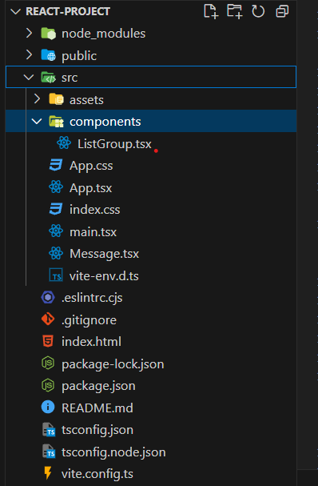
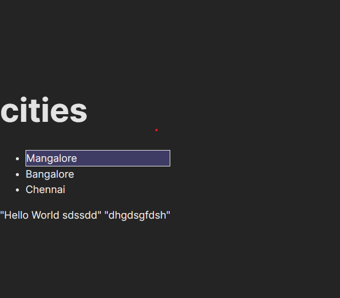

# `React and Vite`

## React

### What is React?
React is a JavaScript library used for building user interfaces.

### Key Features of React:
- Component-Based: React follows a component-based architecture.
- Virtual DOM: React uses a Virtual DOM to optimize updates.
- Reusable Components: You can create reusable UI components.
- State Management: React provides tools for managing component state.
- React Ecosystem: A rich ecosystem of tools and resources is available.

### Usage:
React is used to build user interfaces for web applications, including single-page applications (SPAs), server-rendered applications, and mobile app development (React Native).

## Vite

### What is Vite?
Vite is a fast development tool and build system.

### Key Features of Vite:
- Fast Development: Vite provides a fast development server and supports hot module replacement (HMR).
- Framework-Agnostic: Vite is framework-agnostic and can be used with various JavaScript frameworks.
- Efficient Bundling: Vite uses native ES modules for development and generates optimized bundles for production.
- Plugin System: Vite has a plugin system for extending its functionality.

### Usage:
Vite is often used with modern JavaScript frameworks like React, Vue.js, and Svelte to enhance the development experience.

---


# `How React Works?`

## Introduction to React

React is a JavaScript library used for building user interfaces (UIs) in web applications. It provides a component-based architecture and a virtual DOM to efficiently update the actual DOM, resulting in high-performance UIs.

## Key Concepts

### 1. Components

- **Components** are the building blocks of React applications.
- They are reusable and self-contained units that encapsulate UI and logic.
- Components can be divided into two types: class components and functional components.

### 2. Virtual DOM

- The **Virtual DOM** is an in-memory representation of the actual DOM (Document Object Model).
- React uses the Virtual DOM to optimize updates.
- When a change occurs, React creates a new Virtual DOM tree and calculates the minimal changes needed to update the actual DOM.

### 3. Reconciliation

- **Reconciliation** is the process of updating the actual DOM based on the changes identified in the Virtual DOM.
- React's efficient reconciliation algorithm minimizes the number of DOM manipulations, making updates faster.

## React Workflow

### 1. Initial Rendering

- When a React application loads, it goes through an initial rendering phase.
- React components are rendered into the Virtual DOM, which is then used to update the actual DOM.
- The UI is displayed to the user.

### 2. Handling User Input

- User interactions, such as clicks and input, trigger changes in the application's state.
- When the state changes, React re-renders the affected components and updates the Virtual DOM.

### 3. Virtual DOM Diffing

- React performs a process called **Virtual DOM diffing** to identify the differences between the new Virtual DOM tree and the previous one.
- It calculates the minimal set of changes needed to update the actual DOM.

### 4. Updating the Actual DOM

- Once the changes are calculated, React updates the actual DOM efficiently.
- The updated UI is displayed to the user.

## Benefits of React

- **Performance**: React's Virtual DOM and efficient reconciliation result in faster UI updates.
- **Component Reusability**: Components are reusable and encourage a modular approach to UI development.
- **State Management**: React provides tools for managing component state.
- **Community and Ecosystem**: React has a large and active community with extensive documentation and third-party libraries.

## Conclusion

React's architecture and workflow make it a powerful choice for building modern web applications. Its focus on component reusability and performance optimization has contributed to its widespread adoption in the web development community.


---

# `React-Project structure`


##  main.tsx
```ts
import React from 'react'
import ReactDOM from 'react-dom/client'
import App from './App.tsx'
import './index.css'

ReactDOM.createRoot(document.getElementById('root')!).render(
  <React.StrictMode>
    <App />
  </React.StrictMode>,
)


/*reactDom to render the component Tree( 
  <React.StrictMode> //Another Component, to identify potential Problems
  < App /> //App component
  </React.StrictMode >,
  ) 
  inside an element of id =root

  inorder-words we take the tree and render in the Index.html file inside the div element =>  <div id="root"></div>
  */


 /*
 ReactDOM.createRoot(document.getElementById('root')!) creates a React root, which is used for rendering the component tree into the HTML element with the id attribute set to "root."
<React.StrictMode> is a component used for identifying potential problems and warnings during development. It wraps the App component and its descendants to provide additional checks and debugging information.
<App /> represents your top-level React component, and it's wrapped in <React.StrictMode>.
The entire component tree is rendered into the HTML element with the id attribute set to "root," which is typically defined in your index.html file.
This is a common pattern in React applications, where you mount the root component inside an HTML element to kickstart your React application. It's also good practice to use <React.StrictMode> during development to catch potential issues early.*/

```


### creating component called ListGroup

ListGroup.tsx

```ts
function ListGroup() {
    return (
        <>
            <h1>Heading</h1>
            <ul>
                <li>Hi</li>
                <li>Manish</li>
                <li>Singh</li>
                <li>bonjour</li>
            </ul>
        </>
    );

}

// Rendering list in better way
function ListGroup() {

    const item = ['Hi', 'Manish', 'Singh'];
    
    return (
        <>
            <h1>Heading</h1>
            <ul>
                {item.map(item => <li>{item}</li>)}
            </ul>
        </>
    );
}

/*But when we check in developer tool we see console error
//react-jsx-dev-runtime.development.js:87 Warning: Each child in a list should have a unique "key" prop.

Check the render method of `ListGroup`. See https://reactjs.org/link/warning-keys for more information.
    at li
    at ListGroup
    at div
    at App

    */

//Adding Key prop


function ListGroup() {

    const item = ['Hi', 'Manish', 'Singh'];
    
    return (
        <>
            <h1>Heading</h1>
            <ul>
                {item.map(item => <li key={item}>{item}</li>)}
            </ul>
        </>
    );
}

export default ListGroup;
```


# Using the `key` Prop in React

In React, the `key` prop is a special attribute used to identify and optimize rendering in lists. It's crucial for efficiently updating the DOM when working with dynamic lists of elements. Here are some important considerations:

## Uniqueness Matters

- Each `key` should be unique within the same list of elements.
- React uses these keys to efficiently update the DOM when the list changes.

## Stability is Key

- Avoid using elements like the index as keys, especially if the order of items in the list is likely to change.
- Consider using a stable identifier associated with each item, such as a database ID or a unique property.

## Index as a Last Resort

- While using the array index as the key is acceptable in some cases (e.g., static lists with no item reordering), it's best to use a more stable and unique identifier when available.

## Keys and Component Reusability

- When rendering custom React components within a list, pass the `key` prop to the top-level component.
- This ensures that the entire component is treated as a single entity with its own key, promoting component reusability.

Using the `key` prop correctly is essential for React's efficient management of the DOM and component lifecycle, particularly when dealing with dynamic lists of elements.


```ts
function MyComponent() {
  const items = ["item1", "item2", "item3"];

  return (
    <ul>
      {items.map((item, index) => (
        <li key={index}>{item}</li>
      ))}
    </ul>
  );
}

```
---

## `Conditional Rendering in React`

In React, you can conditionally render elements based on certain conditions. Below are two examples of conditional rendering to display a message when an array named `item` has a length of 0:

### Using Ternary Operator
```ts
{item.length === 0 && <p>No item found</p>}
```
In this approach, a ternary operator checks if the item.length is equal to 0. If it is, it renders the <p> element; otherwise, it renders null. This effectively shows the message when there are no items in the array.

### Using Logical AND Operator
```ts
{item.length === 0 && <p>No item found</p>}

```
In this approach, the logical AND (&&) operator is used to conditionally render the <p> element. If item.length is equal to 0, it proceeds to render the <p> element; otherwise, it doesn't render anything. This approach is more concise and commonly used for simple conditional rendering.

Both methods work effectively, but the second one (using the logical AND operator) is more concise and is often preferred in React for simple conditional rendering because it reduces verbosity.

ListGroup.tsx

```ts
//Conditional Rendering
function ListGroup() {

    let item = ['Hi', 'Manish', 'Singh'];
    item = [];
    return (
        <>
            <h1>Heading</h1>
            {item.length == 0 ? <p>No item found</p> : null} //OR
            {item.length === 0 && <p>No item found</p>}
            <ul>
                {item.map(item => <li key={item}>{item}</li>)}
            </ul>
        </>
    );

}

//Better way to write
// { item.length == 0 ? <p>No item found</p> : null }
// { item.length === 0 && <p>No item found</p> }

export default ListGroup;
```


## `Event Handling`

```ts
function ListGroup() {

    let item = ['Hi', 'Manish', 'Singh'];

    return (
        <>
            <h1>Heading</h1>
            {item.length === 0 && <p>No item found</p>}
            <ul>
                {item.map((item, index) => <li key={item} onClick={() => console.log(item, index)}>{item}</li>)}
            </ul>
        </>
    );

}


function ListGroup() {

    let item = ['Hi', 'Manish', 'Singh'];

    return (
        <>
            <h1>Heading</h1>
            {item.length === 0 && <p>No item found</p>}
            <ul>
                {item.map((item) => <li key={item} onClick={(event) => console.log(event)}>{item}</li>)}
            </ul>
        </>
    );

}

```


```ts
import { MouseEvent } from "react";

function ListGroup() {

    let item = ['Hi', 'Manish', 'Singh'];
    // const handleClick = (event) => console.log(event); 
    //TS throws error as event is not having type, so we need to hover on the event in onclick,and try to understand what is the type, its a mouseEveent, so import mouseEvent from React and also add it next to event

    const handleClick = (event: MouseEvent) => console.log(event);

    return (
        <>
            <h1>Heading</h1>
            {item.length === 0 && <p>No item found</p>}
            <ul>
                {item.map((item) => <li key={item} onClick={(event) => console.log(event)}>{item}</li>)}
            </ul>
        </>
    );

}

export default ListGroup;


//final
import { MouseEvent } from "react";

function ListGroup() {

    let item = ['Hi', 'Manish', 'Singh'];
    // const handleClick = (event) => console.log(event); 
    //TS throws error as event is not havinf type, so we need to hover on the event in onclick,and try to understand what is the type, its a mouseEveent, so import mouseEvent from React


    //Event Handler
    const handleClick = (event: MouseEvent) => console.log(event);

    return (
        <>
            <h1>Heading</h1>
            {item.length === 0 && <p>No item found</p>}
            <ul>
                {item.map((item) => <li key={item} onClick={handleClick}>{item}</li>)}
            </ul>
        </>
    );

}

export default ListGroup;
```


## `Managing State`

/* I have added class active and defined in index.css currently in webbrowser it is active for all the list(It is colored), we are gonna use state and update the active on selected li. */

//To do this we need track of index of the selected item


```ts
function ListGroup() {

    let item = ['Hi', 'Manish', 'Singh'];

    let selectedIndex = 0; //selects for first li

    return (
        <>
            <h1>Heading</h1>
            {item.length === 0 && <p>No item found</p>}
            <ul>
                {item.map((item, index) => <li className={selectedIndex === index ? "active" : ""} key={item} onClick={() => console.log(index)}>{item}</li>)}
                {/* changes made here for class to be selected */}

            </ul>
        </>
    );

}
```


//Now based on click on list it should active the selected item
//The below code wont work why?
// you're attempting to manage the selected index using a simple variable selectedIndex. The issue with this approach is that React won't re - render the component when this variable changes.React components re - render when their state or props change.

// In the onClick handler for the list items, you update selectedIndex directly.However, React doesn't detect this as a state change, so the component doesn't re - render, and the UI won't reflect the selected item correctly.

// To make the code work as expected, you should use React's state management mechanisms, such as the useState hook, to manage the selected index. This way, when the state changes, React knows to re-render the component, and the UI will update accordingly.

```ts
function ListGroup() {

    let item = ['Hi', 'Manish', 'Singh'];

    let selectedIndex = -1; //selects none of the lis

    return (
        <>
            <h1>Heading</h1>
            {item.length === 0 && <p>No item found</p>}
            <ul>
                {item.map((item, index) => <li className={selectedIndex === index ? "active" : ""} key={item} onClick={() => { selectedIndex = index; }}>{item}</li>)}
                {/* changes made here for class to be selected && onclick event*/}

            </ul>
        </>
    );

}
```

//Working code
```ts
import { useState } from "react";
function ListGroup() {

    let item = ['Hi', 'Manish', 'Singh'];

    // let selectedIndex = -1; //selects none of the lis
    //hook
    // const arr = useState(-1);
    // arr[0]; // is like var selecetedIndex
    // arr[1] // updatedr fn


    const [selectedIndex, setSelectedIndex] = useState(-1);
    return (
        <>
            <h1>Heading</h1>
            {item.length === 0 && <p>No item found</p>}
            <ul>
                {item.map((item, index) => <li className={selectedIndex === index ? "active" : ""} key={item} onClick={() => { setSelectedIndex(index); }}>{item}</li>)}
                {/* changes made here for class to be selected && onclick event*/}

            </ul>
        </>
    );

}

```
<br>

> Each component can have its own state means?

for example
Adding another ListGroup(copy), the state change you have done previously wont be shared with another ListGroup component

App.tsx

```ts
import ListGroup from "./components/ListGroup";


function App() {
  return <div><ListGroup /> <ListGroup/></div>
}

export default App;
```

### facts about component state

- **Local to Component:** Component state is local and specific to a particular component. It cannot be accessed or modified directly from other components.

- **Mutable:** Component state is mutable, which means you can change its value using methods provided by React, like `setState`.

- **Initialization:** You typically initialize component state in the constructor or by using the `useState` hook in functional components.

- **Asynchronous Updates:** Updates to component state using `setState` may be asynchronous. React may batch multiple updates for performance reasons.

- **Shallow Merge:** When you use `setState`, React performs a shallow merge of the new state with the existing state. This means it updates only the properties you specify, leaving the rest of the state unchanged.

- **Functional Updates:** `setState` can also accept a function as an argument. This is useful when you need to update state based on the previous state, ensuring that updates don't get out of sync.

- **Reactive Rendering:** When component state changes, React automatically re-renders the component to reflect the updated state in the UI.

- **Props vs. State:** While props are used to pass data from a parent component to a child component, state is used for managing data that can change over time within the component itself.

- **Lifecycle Methods:** Class components have lifecycle methods like `componentDidMount` and `componentDidUpdate` where you can work with state. Functional components can use the `useEffect` hook for similar purposes.

- **State Lifting:** To share state between components, you can "lift" the state up to a common ancestor and pass it down as props, making it accessible to multiple components.

- **Local Component Logic:** State is often used to manage local component logic, handle user interactions, and maintain the component's internal state.

- **Conditional Rendering:** Component state is frequently used to conditionally render parts of the UI based on user actions or data changes.

- **Avoid Overusing State:** While state is essential, overusing it can lead to complex component trees. In some cases, it's better to use global state management solutions like Redux or context API.

- **Functional Components and Hooks:** With the introduction of React Hooks, functional components can now also use component state by using the `useState` hook.

- **Stateless Functional Components:** Stateless functional components (SFCs) do not have their own state. They rely solely on props passed to them.

# `Hook`
In React, a hook is a special function that allows you to "hook into" React state and lifecycle features from function components. Hooks were introduced in React 16.8 to provide a way to use state and other React features without writing class components.

Hooks allow you to manage component state, perform side effects, and access lifecycle features within functional components. They make it easier to reuse stateful logic between components and make the code more readable and maintainable.

Some of the commonly used hooks in React include:

useState: Allows you to add state management to functional components.

useEffect: Enables you to perform side effects in function components, such as data fetching, DOM manipulation, and more.

useContext: Allows you to access the context API within functional components, providing a way to share data and functionality across components.

useReducer: Provides a more advanced way to manage complex state logic compared to useState.

useRef: Helps you create mutable references to DOM elements or values that persist across renders.

useMemo and useCallback: Allow you to optimize the performance of your components by memoizing values and functions.

Hooks have become an essential part of React development and have made it possible to write more concise and maintainable code in functional components, reducing the need for class components and the complexities associated with them.


### eli5
Think of hooks in React like tools that allow you to add extra functionality to your functional components. Here's an analogy to help you understand hooks better:

Imagine you have a toolbox, and each tool in the toolbox serves a specific purpose:

useState (State Tool): It's like a tool for keeping track of information within your component. You can use it to store and update data that your component needs to remember, such as user input or component state changes.

useEffect (Effect Tool): This tool lets you perform actions or "effects" at specific times in your component's lifecycle. For example, you can use it to fetch data from a server when the component is first mounted or clean up resources when it's unmounted.

useContext (Context Tool): Imagine it as a tool for sharing information across different parts of your application without passing props manually all the time. It's like a communication tool that allows components to talk to each other.

useReducer (State Logic Tool): This tool helps you manage more complex state-related logic. If your component has multiple state values that depend on each other or needs to handle various actions, useReducer organizes and simplifies that process.

useRef (Reference Tool): It's like a bookmark or sticky note for your component. You can use it to keep track of specific elements in the DOM or to hold on to values across renders without causing re-renders.

These "tools" (or hooks) are designed to help you solve common problems in a consistent and efficient way. You pick the tool you need based on the task at hand, making your code more organized and easier to maintain. Just like a skilled craftsman selects the right tool for each job in their toolbox, React developers choose the appropriate hook for the specific functionality they want to add to their components.


> react will update the dom to match the state means?

In React, the statement "React will update the DOM to match the state" refers to how React manages the rendering and updating of the user interface based on changes in the component's state.

Here's how it works:

Initial Rendering: When a React component is initially rendered or mounted, it creates a virtual representation of the DOM called the "Virtual DOM." This Virtual DOM is a lightweight copy of the actual DOM.

State Changes: When the component's state changes (e.g., through user interactions or data updates), React re-renders the component.

Reconciliation: During the re-rendering process, React compares the new Virtual DOM tree with the previous one to identify the differences (called "diffing" or "reconciliation"). React efficiently calculates the minimum number of changes required to bring the Virtual DOM in sync with the component's new state.

Updating the DOM: Once React has identified the differences, it updates the actual DOM only in the places where changes have occurred. This is known as "reconciliation" or "reconciliation process." It minimizes the manipulation of the real DOM, which can be slow and inefficient.

By updating the DOM only where necessary and minimizing direct interactions with the actual DOM, React ensures that the user interface reflects the current state of the application efficiently and without causing unnecessary performance overhead.

In summary, when you change the state of a React component, React takes care of updating the Virtual DOM and, through its efficient reconciliation process, updates only the necessary parts of the actual DOM to match the new state. This approach is one of the key reasons React is known for its performance and developer-friendly features.

---

## `Passing Data Via Props`
#### we are listing some topic of items, what if we would like to show different list of topics.
> we would not like to create another list, but make use of existing list,(component reusability)

### Reusing Components to Display Different Lists of Topics

If you want to display different lists of topics without creating a separate list component, you can achieve this by using props in your React components. Props, short for properties, allow you to pass data from a parent component to a child component, making your code more reusable.

### Using Props for Reusability

You can pass data to your component by defining props and using them to customize the component's behavior. This way, you can show different lists without duplicating your code.

### Modifying the Code

To implement this, you can modify your component to accept two arguments: an array of items and a heading. In TypeScript, you can define this structure using an interface, for example:

```typescript
//in Type script, we can call it as interface
//ex: {item:[], heading:string}

interface TopicProps {
  items: string[];
  heading: string;
}
```

ListGroup.tsx
```ts
import { useState } from "react";

interface Props {
    items: string[],
    heading: string
}

function ListGroup(props: Props) { //Also add it in app.tsx

    // let item = ['Hi', 'Manish', 'Singh']; //Moved this to App.tsx
    const [selectedIndex, setSelectedIndex] = useState(-1);

    return (
        <>
            <h1>Heading</h1>
            {props.items.length === 0 && <p>No item found</p>}
            <ul>
                {props.items.map((item, index) =>
                    <li className={selectedIndex === index ? "active" : ""} key={item} onClick={() => { setSelectedIndex(index); }}>
                        {item}
                    </li>)}
            </ul>
        </>
    );
}

export default ListGroup;
```

App.tsx
```ts
import ListGroup from "./components/ListGroup";

let items = ['Mangalore', 'Bangalore', 'Chennai'];


function App() {
  return <div><ListGroup items={items} heading="cities" /></div>
}

export default App;
```


```ts
//Props.items, is kind of repetative, hence destructuring in the function param
import { useState } from "react";

interface Props {
    items: string[],
    heading: string
}

function ListGroup({ items, heading }: Props) { //Destructering

    const [selectedIndex, setSelectedIndex] = useState(-1);

    return (
        <>
            <h1>{heading}</h1>
            {items.length === 0 && <p>No item found</p>}
            <ul>
                {items.map((item, index) =>
                    <li className={selectedIndex === index ? "active" : ""} key={item} onClick={() => { setSelectedIndex(index); }}>
                        {item}
                    </li>)}
            </ul>
        </>
    );

}

export default ListGroup;
```
## `prop drilling or passing callback props.`

#### In real world example when we select an item, it needs to do something like printing, filtering or taking to the page etc
#### We can include a seperate function and not touch the existing ListGroup function, 

1. define a function logic in App component when a onclick is done in ListGroup,
2. send it as argument to ListGroup.
3. Add it in the props
4. call the fun and send the selecteditem as param back to app component.


App.tsx
```ts
import ListGroup from "./components/ListGroup";

let items = ['Mangalore', 'Bangalore', 'Chennai'];

const handleSelectItem = (item: string) => {
  console.log(item);
}

function App() {
  return <div><ListGroup items={items} heading="cities" onSelectItem={handleSelectItem} /></div>
}

export default App;
```


ListGroup.tsx
```ts
import { useState } from "react";

interface Props {
    items: string[],
    heading: string,
    onSelectItem: (item: string) => void; //Added the expected interface
}

function ListGroup({ items, heading, onSelectItem }: Props) { //Destructering
    const [selectedIndex, setSelectedIndex] = useState(-1);

    return (
        <>
            <h1>{heading}</h1>
            {items.length === 0 && <p>No item found</p>}
            <ul>
                {items.map((item, index) =>
                    <li className={selectedIndex === index ? "active" : ""} key={item} onClick={() => { setSelectedIndex(index); onSelectItem(item); }}> //Added a function call
                        {item}
                    </li>)}
            </ul >
        </>
    );

}

export default ListGroup;
```
<br>

> suppose i want to write another function during onclick, from where i need to start defining things? from which component.

If you want to add another function to be executed when an item is clicked, you can do so by defining that function in the parent component (App) and passing it as an additional prop to the child component (ListGroup). Here's how you can go about it:

1. If you want to add another function to be executed when an item is clicked, you can do so by defining that function in the parent component (App) and passing it as an additional prop to the child component (ListGroup). Here's how you can go about it:

```ts
function handleAnotherAction(item) {
  // Your logic for the additional action goes here
  console.log(`Additional action for ${item}`);
}
```

2. Pass this new function as a prop to the ListGroup component when rendering it in the App component:

```ts
function App() {
  return (
    <div>
      <ListGroup
        items={items}
        heading="cities"
        onSelectItem={handleSelectItem}
        onAnotherAction={handleAnotherAction}
      />
    </div>
  );
}
```

3. In the ListGroup component, update the Props interface to include the new prop:

```ts
interface Props {
  items: string[];
  heading: string;
  onSelectItem: (item: string) => void;
  onAnotherAction: (item: string) => void;
}
```

4. Modify the onClick event handler in the ListGroup component to call the new function when an item is clicked:

```ts
<li
  className={selectedIndex === index ? "active" : ""}
  key={item}
  onClick={() => {
    setSelectedIndex(index);
    onSelectItem(item);
    onAnotherAction(item); // Call the new function here
  }}
>
  {item}
</li>

```
<br>

>what is this whole process is called?

The process of passing multiple callback functions or handling multiple actions through props in a React component hierarchy is generally referred to as **"prop drilling" or "passing callback props."**

Prop drilling occurs when you need to pass data or functions through several levels of nested components. In your case, you are passing both onSelectItem and onAnotherAction callback functions from the parent component (App) to a child component (ListGroup), and potentially even deeper into the component tree. This allows you to maintain a unidirectional data flow while still enabling different components at various levels to react to user interactions.

While prop drilling is a common and valid approach in React, it can become cumbersome as your component tree grows larger and deeper. `In such cases, you might consider using state management libraries like Redux or React Context to centralize and manage your application's state and actions more efficiently, reducing the need for prop drilling.`


---
## `Passing Childern`
## How to create a component that can pass the childern


#### create a component Alert.tsx

Alert.tsx
```ts
interface Props {
    text: string
}

function Alert({ text }: Props) {
    return <div>{text}</div>
}

export default Alert;
```

App.tsx
```ts
import ListGroup from "./components/ListGroup";
import Alert from "./components/Alert";

let items = ['Mangalore', 'Bangalore', 'Chennai'];

const handleSelectItem = (item: string) => {
  console.log(item);
}

function App() {
  return <>
    <div><ListGroup items={items} heading="cities" onSelectItem={handleSelectItem} /></div>
    <Alert text="Hello World" /> //Added this
  </>
}

export default App;
```
<br>

> what if the text is huge in Alert?

You could think of below code to do that.
But thats not gonna work.

```ts
import ListGroup from "./components/ListGroup";
import Alert from "./components/Alert";

let items = ['Mangalore', 'Bangalore', 'Chennai'];

const handleSelectItem = (item: string) => {
  console.log(item);
}

function App() {
  return <>
    <div><ListGroup items={items} heading="cities" onSelectItem={handleSelectItem} /></div>
    <Alert>
      "Hello World hghdfg lijgdsiug" //You may think of like this
    </Alert>
  </>
}

export default App;
```
<br>

`solution`

In React Interface Props we can remove the text property and add children.

```ts
interface Props {
    children: string
}

function Alert({ children }: Props) {
    return <div>{children}</div>
}

export default Alert;
```

```ts
import ListGroup from "./components/ListGroup";
import Alert from "./components/Alert";

let items = ['Mangalore', 'Bangalore', 'Chennai'];

const handleSelectItem = (item: string) => {
  console.log(item);
}

function App() {
  return <>
    <div><ListGroup items={items} heading="cities" onSelectItem={handleSelectItem} /></div>
    <Alert>
        "Hello World sdssdd"
        "dhgdsgfdsh"
    </Alert>
  </>
}

export default App;
```
<br>




<br>

> what if we want to pass the html elements?

like below

```ts
<Alert>
      Hello World <span>Hi</span>
</Alert>
```
To achive this we need to make change in Interface in Alert.tsx

```tsx
import { ReactNode } from 'react';

interface Props {
    children: ReactNode
}

function Alert({ children }: Props) {
    return <div>{children}</div>
}

export default Alert;
```

```tsx
import ListGroup from "./components/ListGroup";
import Alert from "./components/Alert";

let items = ['Mangalore', 'Bangalore', 'Chennai'];

const handleSelectItem = (item: string) => {
  console.log(item);
}

function App() {
  return <>
    <div><ListGroup items={items} heading="cities" onSelectItem={handleSelectItem} /></div>
    <Alert>
      Hello World <span>Hi</span>
    </Alert>
  </>
}

export default App;

```


---

# React Interview Questions and Answers

1. **What is React?**
   - React is a JavaScript library for building user interfaces.

2. **What is the Virtual DOM in React?**
   - The Virtual DOM is an in-memory representation of the actual DOM. React uses it to optimize updates by calculating and applying minimal changes to the real DOM.

3. **What is JSX in React?**
   - JSX (JavaScript XML) is a syntax extension used in React for defining elements and components. It allows you to write HTML-like code within JavaScript.

4. **What are React components?**
   - React components are reusable, self-contained building blocks that encapsulate UI and logic.

5. **What is state in React?**
   - State in React is an object that stores data relevant to a component. Changes to state trigger re-rendering of the component.

6. **What is the difference between props and state in React?**
   - Props (short for properties) are used to pass data from parent to child components, while state is used to manage data within a component.

7. **Explain the React component lifecycle methods.**
   - React components have lifecycle methods like `componentDidMount`, `componentDidUpdate`, and `componentWillUnmount` that allow you to perform actions at specific points in a component's life.

8. **What is React Router, and why is it used?**
   - React Router is a library for adding routing to React applications. It allows you to create single-page applications with multiple views.

9. **What is the purpose of React's Context API?**
   - React's Context API is used for sharing state across components without having to pass props manually through all levels of the component tree.

10. **What is Redux, and how does it relate to React?**
    - Redux is a state management library often used with React to manage global application state. It provides a predictable way to manage and update state.
