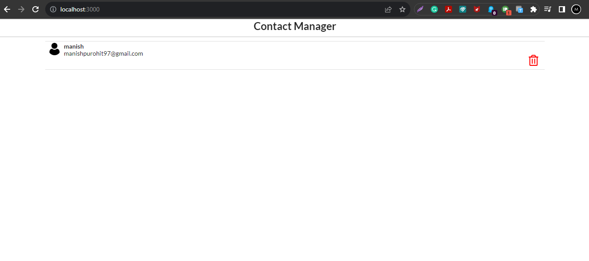
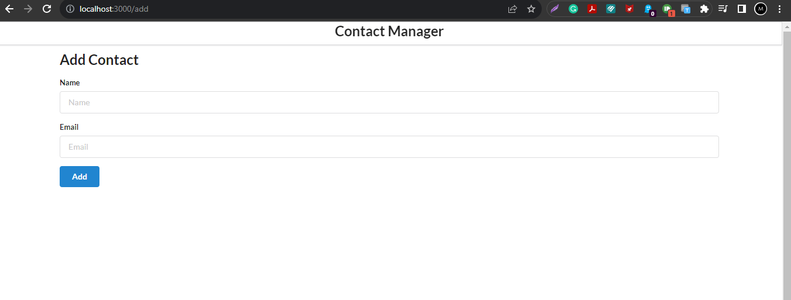
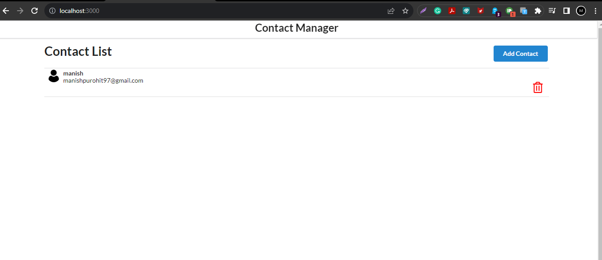
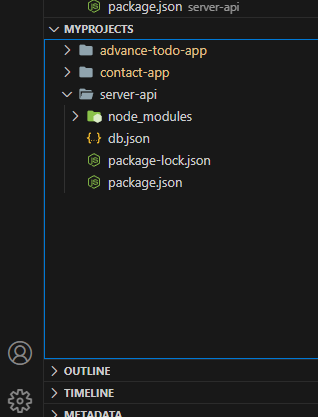

# Getting Started with Create React App

This project was bootstrapped with [Create React App](https://github.com/facebook/create-react-app).

## Available Scripts

In the project directory, you can run:

### `npm start`

Runs the app in the development mode.\
Open [http://localhost:3000](http://localhost:3000) to view it in your browser.

The page will reload when you make changes.\
You may also see any lint errors in the console.

### `npm test`

Launches the test runner in the interactive watch mode.\
See the section about [running tests](https://facebook.github.io/create-react-app/docs/running-tests) for more information.

### `npm run build`

Builds the app for production to the `build` folder.\
It correctly bundles React in production mode and optimizes the build for the best performance.

The build is minified and the filenames include the hashes.\
Your app is ready to be deployed!

See the section about [deployment](https://facebook.github.io/create-react-app/docs/deployment) for more information.

### `npm run eject`

**Note: this is a one-way operation. Once you `eject`, you can't go back!**

If you aren't satisfied with the build tool and configuration choices, you can `eject` at any time. This command will remove the single build dependency from your project.

Instead, it will copy all the configuration files and the transitive dependencies (webpack, Babel, ESLint, etc) right into your project so you have full control over them. All of the commands except `eject` will still work, but they will point to the copied scripts so you can tweak them. At this point you're on your own.

You don't have to ever use `eject`. The curated feature set is suitable for small and middle deployments, and you shouldn't feel obligated to use this feature. However we understand that this tool wouldn't be useful if you couldn't customize it when you are ready for it.

## Learn More

You can learn more in the [Create React App documentation](https://facebook.github.io/create-react-app/docs/getting-started).

To learn React, check out the [React documentation](https://reactjs.org/).

### Code Splitting

This section has moved here: [https://facebook.github.io/create-react-app/docs/code-splitting](https://facebook.github.io/create-react-app/docs/code-splitting)

### Analyzing the Bundle Size

This section has moved here: [https://facebook.github.io/create-react-app/docs/analyzing-the-bundle-size](https://facebook.github.io/create-react-app/docs/analyzing-the-bundle-size)

### Making a Progressive Web App

This section has moved here: [https://facebook.github.io/create-react-app/docs/making-a-progressive-web-app](https://facebook.github.io/create-react-app/docs/making-a-progressive-web-app)

### Advanced Configuration

This section has moved here: [https://facebook.github.io/create-react-app/docs/advanced-configuration](https://facebook.github.io/create-react-app/docs/advanced-configuration)

### Deployment

This section has moved here: [https://facebook.github.io/create-react-app/docs/deployment](https://facebook.github.io/create-react-app/docs/deployment)

### `npm run build` fails to minify

This section has moved here: [https://facebook.github.io/create-react-app/docs/troubleshooting#npm-run-build-fails-to-minify](https://facebook.github.io/create-react-app/docs/troubleshooting#npm-run-build-fails-to-minify)


//Label and normal text difference

//class component vs functional components


---


# Initial Design Layout


## created Components
---
#### App.js
#### Header.js
#### AddContacts.js
#### ContactList.js
#### ContactCard.js

--- 


## App.js
```js
import React from 'react';
import './App.css';
import Header from './Header';
import AddContact from './AddContact';
import ContactList from './ContactList'


function App() {

  const contacts = [{
    'id': 1,
    'name': 'Manish',
    'email': 'manishpurohit97@gmail.com'
  }, {
    'id': 2,
    'name': 'John',
    'email': 'john@gmail.com'
  }];


  return <>
    <div className="ui container">
      <Header />
      <AddContact />
      <ContactList contacts={contacts} />
    </div>
  </>
}

export default App;

```

#### Header.js

```js
import React from 'react';

const Header = () => {
    return <>
        <div className="ui fixed menu">
            <div className="ui center container" style={{ justifyContent: 'center' }}>
                <h2>Contact Manager</h2>
            </div>
        </div>
    </>
}


export default Header;
```
#### AddContacts.js

```js
//Class Component
import React from "react";

class AddContact extends React.Component {
    render() {
        return <>
            <div className="ui main">
                <h2 style={{ marginTop: '50px' }}>Add Contact</h2>
                <form className="ui form">
                    <div className="field">
                        <label>Name</label>
                        <input type="text" name="name" placeholder="Name"></input>
                    </div>
                    <div className="field">
                        <label>Email</label>
                        <input type="text" name="email" placeholder="Email"></input>
                    </div>
                    <button className="ui button blue">Add</button>
                </form>
            </div>
        </>
    }
}

export default AddContact;
```
#### ContactList.js

```js
import React from 'react';
import ContactCard from './ContactCard';


const ContactList = (props) => {

    const renderContact = props.contacts.map((contact) => {
        return (
            <ContactCard contact={contact} />
        )
    })

    return <>
        <div className='ui celled list'>{renderContact}</div>
    </>
}

export default ContactList;
```
#### ContactCard.js

```js
import React from "react";
import user from '../images/user.png';


const ContactCard = (props) => {
    const { id, name, email } = props.contact;

    return (
        <div className="item">
            </img>
            <div className='content'>
                <div className='header'>{name}</div>
                <div>{email}</div>
            </div>
            <div style={{ display: 'flex', justifyContent: 'flex-end' }} >
                <i className='trash alternate outline icon' style={{ color: "red", fontSize: '25px' }} ></i>
            </div>
        </div >
    )
}

export default ContactCard
```


---

## Start of functionality changes.
whenever you enter a name or email and submit, you got the data and need to update in state object, this state object you need to pass to the App.js and app.js will send it to ContactList

AddContact.js

```js
//Class Component
import React from "react";

class AddContact extends React.Component {

    state = {
        name: "",
        email: ""
    }

    add = (e) => {
        e.preventDefault();
        if (this.state.name === "" || this.state.email === "") {
            alert("All fields are required");
            return;
        }
        this.props.addContactHandler(this.state);
        this.setState({ name: "", email: "" });
    }


    render() {
        return <>
            <div className="ui main">
                <h2 style={{ marginTop: '50px' }}>Add Contact</h2>
                <form className="ui form" onSubmit={this.add}>
                    <div className="field">
                        <label>Name</label>
                        <input type="text" name="name" placeholder="Name" onChange={(e) => this.setState({ name: e.target.value })} value={this.state.name} ></input>
                    </div>
                    <div className="field">
                        <label>Email</label>
                        <input type="text" name="email" placeholder="Email" onChange={(e) => this.setState({ email: e.target.value })} value={this.state.email}></input>
                    </div>
                    <button className="ui button blue">Add</button>
                </form>
            </div>
        </>
    }
}

export default AddContact;
```


App.js
```js
import React, { useState } from 'react';
import './App.css';
import Header from './Header';
import AddContact from './AddContact';
import ContactList from './ContactList'


function App() {

  const [contacts, setContacts] = useState([]);

  // const contacts = [{
  //   'id': 1,
  //   'name': 'Manish',
  //   'email': 'manishpurohit97@gmail.com'
  // }, {
  //   'id': 2,
  //   'name': 'John',
  //   'email': 'john@gmail.com'
  // }];


  const addContactHandler = (contact) => {
    setContacts([...contacts, contact]); //creates a shaloow copy and append the new contact to it.
  }


  return <>
    <div className="ui container">
      <Header />
      <AddContact addContactHandler={addContactHandler} />
      <ContactList contacts={contacts} />
    </div>
  </>
}

export default App;

```


<br>


> How to send Data from child to Parent


In React, you can send data from a child component to a parent component by defining a callback function in the parent component and passing it as a prop to the child component. The child component can then call this callback function and pass data as an argument to it when an event or action occurs. This is known as "lifting state up."


In simple terms, think of it like this:

App.js is like a parent who has a bucket.
The child component is like a helper or friend who can fill that bucket with content.
So, in this analogy:

App.js provides an empty bucket (some data or a function) to the child component as a prop.
The child component does something (like collecting items) and puts those items (data or a result) into the bucket.
App.js can then access the filled bucket to get the content (data or result) placed there by the child component.
This is how data or functionality is passed from a parent component to a child component and then returned or retrieved back to the parent component in a typical React application.


<br>

Now i can add name and email
 - it will add to list
 - re set the state to blank in name and email field.
 - but on referesh the list is lost.


## solution to persist the list

Use useEffect and create a local storage to store the contacts
//check in inspect > Applications > Local Storage. any new addition to the list it should be displaying.

Use another useEffect to retrive the content from the LocalStorage and store it in a variable.
if contents are available try to setContacts.


App.js

```js
import React, { useState, useEffect } from 'react';
import './App.css';
import Header from './Header';
import AddContact from './AddContact';
import ContactList from './ContactList'


function App() {
  const LOCAL_STORAGE_KEY = 'contacts';

  const [contacts, setContacts] = useState(() => {
    const retriveContacts = JSON.parse(localStorage.getItem(LOCAL_STORAGE_KEY));
    return retriveContacts || [];
  }); //Added 2. to retrieve the data

  const addContactHandler = (contact) => {
    setContacts([...contacts, contact]);
  }

  useEffect(() => {
    localStorage.setItem(LOCAL_STORAGE_KEY, JSON.stringify(contacts))
  }, [contacts]); //Adde 1. to store it in LocalStorage


  return <>
    <div className="ui container">
      <Header />
      <AddContact addContactHandler={addContactHandler} />
      <ContactList contacts={contacts} />
    </div>
  </>
}

export default App;

```

what is useEffect?
what is the syntax?
what is localStorage? and how to store it.
LocalStorage how it works in production?

1. **What is `useEffect`?**
   - `useEffect` is a React hook that allows you to perform side effects in functional components. Side effects include data fetching, DOM manipulation, and subscribing to external data sources. `useEffect` is used for managing the lifecycle of a component in a way that's similar to lifecycle methods in class components.

2. **Syntax of `useEffect`:**
   - The basic syntax of `useEffect` is as follows:
     ```javascript
     useEffect(() => {
       // Side effect code goes here
     }, [dependencies]);
     ```
     - The first argument to `useEffect` is a function that contains the code for the side effect.
     - The second argument is an optional array of dependencies. If provided, the effect will run when any of the dependencies change. If omitted, the effect runs after every render.

3. **What is `localStorage`? How to store data in it:**
   - `localStorage` is a web API that provides a simple way to store key-value pairs in a web browser. It allows you to store data persistently on the client-side.
   - To store data in `localStorage`, you can use the `setItem` method like this:
     ```javascript
     localStorage.setItem('key', 'value');
     ```
     - For example, to store a user's name:
     ```javascript
     localStorage.setItem('username', 'John');
     ```

4. **How `localStorage` works in production:**
   - `localStorage` is a client-side storage solution, and its data is stored in the user's web browser. It persists between sessions and page refreshes.
   - In production, you can use `localStorage` to store user preferences, authentication tokens, and other small amounts of data that you want to persist on the user's device.
   - Keep in mind that `localStorage` has a limited storage capacity (usually around 5-10MB per domain) and is synchronous, which means it can block the main thread. Therefore, it's not suitable for storing large amounts of data or for performance-critical operations.
   - When using `localStorage` in production, consider data security and privacy. Be cautious about storing sensitive information, and avoid storing data that should not be accessible to other scripts or websites.

Here's an example of how to use `localStorage` to store and retrieve data:

```javascript
// Storing data in localStorage
localStorage.setItem('username', 'John');

// Retrieving data from localStorage
const username = localStorage.getItem('username');
console.log(username); // Output: 'John'
```


## Adding a unique id, (key) to the each contact

```js
import React, { useState, useEffect } from 'react';
import './App.css';
import Header from './Header';
import AddContact from './AddContact';
import ContactList from './ContactList'
import { v4 as uuidv4 } from 'uuid'; //Imported


function App() {
  const LOCAL_STORAGE_KEY = 'contacts';

  const [contacts, setContacts] = useState(() => {
    const retriveContacts = JSON.parse(localStorage.getItem(LOCAL_STORAGE_KEY));
    return retriveContacts || [];
  });;


  const addContactHandler = (contact) => {
    setContacts([...contacts, { id: uuidv4(), ...contact }]); //Adding id
  };

  useEffect(() => {
    localStorage.setItem(LOCAL_STORAGE_KEY, JSON.stringify(contacts))
  }, [contacts]);


  return <>
    <div className="ui container">
      <Header />
      <AddContact addContactHandler={addContactHandler} />
      <ContactList contacts={contacts} />
    </div>
  </>
}

export default App;
```


## Deleting the contact

create a main function in app.js that filters the contact list with th id as argument.
// the function will return all other list except the mentioned key to delete.

we need to pass this call back fn as a prop in contactList.

The Contact list is Dependent on the contactCard, the contact card has the delete icon which will grab the id.

//so when your passing the prop function from app.js to contactList,create another function and send it as another prop function to the contactCard. 

//in general the child components sends to middle parent and middle parent to parent.
```js
import React, { useState, useEffect } from 'react';
import './App.css';
import Header from './Header';
import AddContact from './AddContact';
import ContactList from './ContactList'
import { v4 as uuidv4 } from 'uuid';


function App() {
  const LOCAL_STORAGE_KEY = 'contacts';

  const [contacts, setContacts] = useState(() => {
    const retriveContacts = JSON.parse(localStorage.getItem(LOCAL_STORAGE_KEY));
    return retriveContacts || [];
  });;

  const addContactHandler = (contact) => {
    setContacts([...contacts, { id: uuidv4(), ...contact }]);
  };


  //created this main fn to delete
  const removeContactHandler = (id) => {
    const newContactList = contacts.filter((contact) => { return contact.id !== id });
    setContacts(newContactList);
  }

  useEffect(() => {
    localStorage.setItem(LOCAL_STORAGE_KEY, JSON.stringify(contacts))
  }, [contacts]);


  return <>
    <div className="ui container">
      <Header />
      <AddContact addContactHandler={addContactHandler} />
      <ContactList contacts={contacts} getContactId={removeContactHandler} /> {//sent as prop fn to ContactList}
    </div>
  </>
}

export default App;

```

ContactList.js
```js
import React from 'react';
import ContactCard from './ContactCard';


const ContactList = (props) => {

  //created bridge fn that grabs id from contactCard and sends the prop.getContactId back to App.js
    const deleteConatactHandler = (id) => {
        props.getContactId(id);
    }
    
    const renderContact = props.contacts.map((contact) => {
        return (
            <ContactCard key={contact.id} contact={contact} clickHandler={deleteConatactHandler} /> //Added key
        )
    })

    return <>
        <div className='ui celled list'>{renderContact}</div>
    </>
}

export default ContactList;
```

ContactCard.js


```js
import React from "react";
import user from '../images/user.png';


const ContactCard = (props) => {
    const { id, name, email } = props.contact;

    return (
        <div className="item">
            </img>
            <div className='content'>
                <div className='header'>{name}</div>
                <div>{email}</div>
            </div>
            <div style={{ display: 'flex', justifyContent: 'flex-end' }} >
                <i className='trash alternate outline icon' style={{ color: "red", fontSize: '25px' }} onClick={() => props.clickHandler(id)} ></i> {//Added onclick on trash button to grab the id}
            </div>
        </div >
    )
}

export default ContactCard
```


## React Route

now we dont want all the components to be listed in a page, we will configure routes

In the latest version of React Router (version 6), which you seem to be using in your code, you don't necessarily need the <Switch> component. In React Router v6, the <Routes> component automatically matches and renders the first <Route> or <Route> element that matches the current URL, similar to what <Switch> does in React Router v5.

So, while you can use <Routes> without <Switch>, it's not strictly required in React Router v6. Your code should work correctly without it, as shown in the corrected code I provided in my previous response.







App.js

```js
import React, { useState, useEffect } from 'react';
import { BrowserRouter as Router, Route, Routes } from 'react-router-dom';
import './App.css';
import Header from './Header';
import AddContact from './AddContact';
import ContactList from './ContactList'
import { v4 as uuidv4 } from 'uuid';


function App() {
  const LOCAL_STORAGE_KEY = 'contacts';

  const [contacts, setContacts] = useState(() => {
    const retriveContacts = JSON.parse(localStorage.getItem(LOCAL_STORAGE_KEY));
    return retriveContacts || [];
  });;

  const addContactHandler = (contact) => {
    setContacts([...contacts, { id: uuidv4(), ...contact }]);
  };


  const removeContactHandler = (id) => {
    const newContactList = contacts.filter((contact) => { return contact.id !== id });
    setContacts(newContactList);
  }

  useEffect(() => {
    localStorage.setItem(LOCAL_STORAGE_KEY, JSON.stringify(contacts))
  }, [contacts]);


  return <>
    <div className="ui container">
      <Router>
        <Header />
        <Routes>
          <Route path="/" element={<ContactList contacts={contacts} getContactId={removeContactHandler} />} />
          <Route path="/add" element={<AddContact addContactHandler={addContactHandler} />} />
        </Routes>
      </Router>
    </div>
  </>
}

export default App;
```

<br>

need to add a button at home page where the contactList are displayed.
This button when clicked should route to the AddContact page i.e /add

This can be done by adding button in ContactList.js
amd wrapping it with Link tag, having Attribute "to", which we will mention the route Path String
import Link from react-router-dom Package



ContactList.js

```js
import React from 'react';
import ContactCard from './ContactCard';
import { Link } from 'react-router-dom'; //Added


const ContactList = (props) => {

    const deleteConatactHandler = (id) => {
        props.getContactId(id);
    }

    const renderContact = props.contacts.map((contact) => {
        return (
            <ContactCard key={contact.id} contact={contact} clickHandler={deleteConatactHandler} />
        )
    })


    return <>
        <div class="main" style={{ marginTop: "50px" }}>
            <h1 style={{ display: 'flex', justifyContent: 'space-between' }}>
                Contact List
                <Link to={"/add"}>
                <button className='ui button blue'>Add Contact</button>
                </Link>
            </h1>
            <div className='ui celled list'>{renderContact}</div>
        </div>
    </>
}

export default ContactList;

```


Now i would like to addContact, after that it should be taking back to Home page.
I can think of adding Link fro ADD button in AddContact.js, but this is gonna first direct it to homePage and never gonna add the contacts

//As of now, I see the AddContact is a class Function and react-router uses useNavigate(to navigate back) thats applicable only on functional Componenents.(I need to research more on this).
//This functionality is not implemented yet


Click on each contact and should take you to the new Page

//Using Link from react-router-dom wrapping around name and email div.

//created new contactDetails Component
//As of now the details are hardcoded.

contactDetails.js

```js 
import React from "react";
import user from '../images/user.png';

export const ContactDetails = (props) => {
    return (
        <div className="main">
            <div className="ui card centered" style={{ marginTop: '80px' }}>
                <div className="image">
                    
                </div>
                <div className="content">
                    <div className="header">Manish</div>
                    <div className="description">Manish@gmail.com</div>
                </div>
            </div>
        </div>
    )
}


export default ContactDetails;

```


ContactCard.js
```js
import React from "react";
import user from '../images/user.png';
import { Link } from 'react-router-dom';


const ContactCard = (props) => {
    const { id, name, email } = props.contact;

    return (
        <div className="item">
            </img>
            <div className='content'>
                <Link to={`/contact/${id}`}> {//Added this}
                    <div className='header'>{name}</div>
                    <div>{email}</div>
                </Link>
            </div>
            <div style={{ display: 'flex', justifyContent: 'flex-end' }} >
                <i className='trash alternate outline icon' style={{ color: "red", fontSize: '25px' }} onClick={() => props.clickHandler(id)} ></i>
            </div>
        </div >
    )
}

export default ContactCard
```
 

App.js
```js
import React, { useState, useEffect } from 'react';
import { BrowserRouter as Router, Route, Routes } from 'react-router-dom';
import './App.css';
import Header from './Header';
import AddContact from './AddContact';
import ContactList from './ContactList'
import { v4 as uuidv4 } from 'uuid';
import ContactDetails from './ContactDetails';


function App() {
  const LOCAL_STORAGE_KEY = 'contacts';

  const [contacts, setContacts] = useState(() => {
    const retriveContacts = JSON.parse(localStorage.getItem(LOCAL_STORAGE_KEY));
    return retriveContacts || [];
  });;

  const addContactHandler = (contact) => {
    setContacts([...contacts, { id: uuidv4(), ...contact }]);
  };


  const removeContactHandler = (id) => {
    const newContactList = contacts.filter((contact) => { return contact.id !== id });
    setContacts(newContactList);
  }

  useEffect(() => {
    localStorage.setItem(LOCAL_STORAGE_KEY, JSON.stringify(contacts))
  }, [contacts]);


  return <>
    <div className="ui container">
      <Router>
        <Header />
        <Routes>
          <Route path="/" element={<ContactList contacts={contacts} getContactId={removeContactHandler} />} />
          <Route path="/add" element={<AddContact addContactHandler={addContactHandler} />} />
          <Route path="/contact/:id" element={<ContactDetails></ContactDetails>} /> //Added this
        </Routes>
      </Router>
    </div>
  </>
}

export default App;

```

now we need to pass appropriate data to the contactDetail page

contactDetail.js

```js

import React from "react";
import user from '../images/user.png';
import { Link } from 'react-router-dom';


const ContactCard = (props) => {
    const { id, name, email } = props.contact;

    return (
        <div className="item">
            </img>
            <div className='content'>
                <Link to={`/contact/${id}`} state={{ contact: props.contact }}> //Added this
                    <div className='header'>{name}</div>
                    <div>{email}</div>
                </Link>
            </div>
            <div style={{ display: 'flex', justifyContent: 'flex-end' }} >
                <i className='trash alternate outline icon' style={{ color: "red", fontSize: '25px' }} onClick={() => props.clickHandler(id)} ></i>
            </div>
        </div >
    )
}

export default ContactCard
```

#### Made use of useLocation(); to get the state object from contactCard.js

`useLocation` is a hook provided by the react-router-dom library for React applications. It allows you to access and work with the current URL location in your application. This hook is particularly useful when you need to access the current URL pathname, query parameters, or other parts of the URL.

Here's how you can use useLocation:
```js 

First, you need to import it from react-router-dom:
javascript
Copy code
import { useLocation } from 'react-router-dom';
Then, you can use it within a functional component to access the current location data:
javascript
Copy code
function MyComponent() {
  const location = useLocation();

  // Now, you can access location data, such as pathname and search parameters.
  const { pathname, search } = location;

  // Example usage:
  return (
    <div>
      <p>Current Pathname: {pathname}</p>
      <p>Query Parameters: {search}</p>
    </div>
  );
}
```
Here are some key properties and concepts related to the location object obtained from useLocation:

`pathname`: Represents the current pathname part of the URL, which typically corresponds to the route path.

`search`: Contains the query string part of the URL, including the "?" character and any query parameters.

`hash`: Contains the fragment identifier part of the URL, including the "#" character.

`state`: Allows you to pass state data between routes using the location object. You can set state when navigating to a new route and access it in the target route.

Here's an example of how to use useLocation in a React component to display the current pathname and query parameters:

```javascript
import { useLocation } from 'react-router-dom';

function MyComponent() {
  const location = useLocation();
  const { pathname, search } = location;

  return (
    <div>
      <p>Current Pathname: {pathname}</p>
      <p>Query Parameters: {search}</p>
    </div>
  );
}
```

With useLocation, you can access and utilize the URL information in your React application to implement dynamic behavior, routing logic, or data fetching based on the current location.

--- 


ContactDetails.js
```js
import React from "react";
import user from '../images/user.png';
import { Link, useLocation } from "react-router-dom";


export const ContactDetails = (props) => {
    let { state } = useLocation();
    console.log(state);
    return (
        <div className="main">
            <div className="ui card centered" style={{ marginTop: '80px' }}>
                <div className="image">
                    
                </div>
                <div className="content">
                    <div className="header">{state.contact.name}</div>
                    <div className="description">{state.contact.email}</div>
                </div>
            </div>
            <div className="center-div">
                <Link to={'/'}>
                    <button className="ui button blue">👈Back</button>
                </Link>
            </div>
        </div>
    )
}


export default ContactDetails;

```


#Storing and fetching data from db instead of local storage.

create a new folder parallel to contact-api name it as server-api
run terminal with `npm init --yes` this will create package.json

//Lets install the json-server,what is json-server?

`npm i --save json-server`


Now create a db.json to storte the data

you can get live data from inspect > application - contacts
add it in json temperorly

in package.json , remove test and replace it with "

package.json
```json
{
  "name": "server-api",
  "version": "1.0.0",
  "description": "",
  "main": "index.js",
  "scripts": {
// "test": "echo \"Error: no test specified\" && exit 1"
    "start": "json-server -p 3006 -w db.json"
  },
  "keywords": [],
  "author": "",
  "license": "ISC",
  "dependencies": {
    "json-server": "^0.17.4"
  }
}

```


The command json-server -p 3006 -w db.json is used to start a JSON server, typically used for mocking and serving JSON data over HTTP for development purposes. Let's break down each part of the command:

json-server: This is the name of the command-line tool or package you are running. It is used to start the JSON server.

-p 3006: This is an option for the JSON server. It specifies the port on which the server should listen for incoming HTTP requests. In this case, the server will listen on port 3006. You can access the JSON data via URLs like http://localhost:3006.

-w db.json: This is another option for the JSON server. It specifies the source file for the JSON data that the server will serve. In this case, the data is stored in a file named db.json. The server will read this file and expose its contents as JSON data through HTTP endpoints.

So, when you run json-server -p 3006 -w db.json, you are starting a JSON server on port 3006 that serves the data from the db.json file. This is commonly used in development environments to create a simple API for testing and prototyping without needing a full backend server. Developers can make HTTP requests to this server to simulate interactions with an actual API.




---

Now we can start the npm start for the sever-api, it will show up the contact list.

We will try to make changes in code to fetch the data from json-server db 

We will install the AXIOS package
`npm i --save axios` in contact-app folder

#Notes 
what is Axios

Axios is a popular JavaScript library used for making HTTP requests from web browsers and Node.js applications. It simplifies the process of sending HTTP requests and handling responses. Here are some common use cases and features of the Axios package:

Making HTTP Requests:
You can use Axios to send HTTP requests to APIs or servers. It supports various HTTP methods like GET, POST, PUT, DELETE, etc.

Example of making a GET request:

```js

const axios = require('axios');

axios.get('https://api.example.com/data')
  .then(response => {
    // Handle the response data here
    console.log(response.data);
  })
  .catch(error => {
    // Handle any errors that occur
    console.error(error);
  });
```
Promise-Based:
Axios uses Promises, making it easy to work with asynchronous operations. You can use .then() to handle successful responses and .catch() to handle errors.

Interceptors:
Axios allows you to define interceptors for requests and responses. This can be useful for adding headers, logging, or globally handling errors.

Handling Response Data:
Axios automatically parses JSON responses and provides the response data directly. You can access the data with response.data.

Sending Data:
You can send data in the request body, query parameters, or as form data using Axios.

Example of making a POST request with data:

```js
axios.post('https://api.example.com/create', { name: 'John', age: 30 })
  .then(response => {
    // Handle the response data here
    console.log(response.data);
  })
  .catch(error => {
    // Handle any errors that occur
    console.error(error);
  });

```
Configurable:
Axios provides a wide range of configuration options, including custom headers, request timeouts, and more.

Example of setting custom headers:

```JS 
axios.get('https://api.example.com/data', {
  headers: {
    'Authorization': 'Bearer myToken',
  },
})
.then(response => {
  // Handle the response
})
.catch(error => {
  // Handle errors
});

```

Canceling Requests:
Axios supports canceling requests, which can be helpful in scenarios where you need to cancel an ongoing request.

Example of canceling a request:

```js 
const source = axios.CancelToken.source();

axios.get('https://api.example.com/data', {
  cancelToken: source.token,
})
.then(response => {
  // Handle the response
})
.catch(error => {
  if (axios.isCancel(error)) {
    // Handle request cancellation
    console.log('Request canceled:', error.message);
  } else {
    // Handle other errors
    console.error(error);
  }
});

// Cancel the request
source.cancel('Request canceled by the user.');

```
Axios is widely used in web development to interact with RESTful APIs and other HTTP services due to its simplicity and flexibility. It is often used in combination with frontend frameworks like React, Angular, or Vue.js to handle data retrieval and submission.

---
I created new folder in contact-app/src named it as api -added a contact.js and defined below:


```js
import axios from 'axios';

export default axios.create({
    baseURL: "http://localhost:3006/"
});
```

Lets start making changes in app.js

//fetch all Contacts


