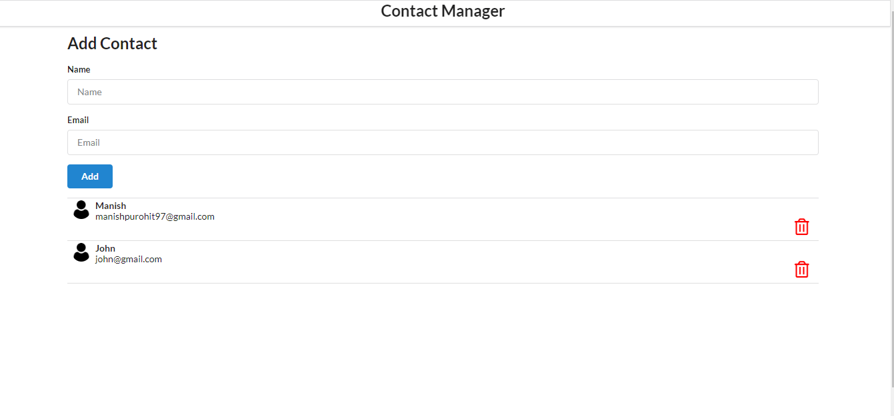
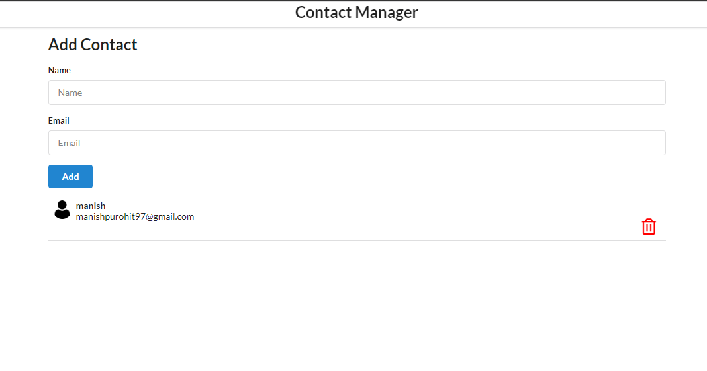

# Getting Started with Create React App

This project was bootstrapped with [Create React App](https://github.com/facebook/create-react-app).

## Available Scripts

In the project directory, you can run:

### `npm start`

Runs the app in the development mode.\
Open [http://localhost:3000](http://localhost:3000) to view it in your browser.

The page will reload when you make changes.\
You may also see any lint errors in the console.

### `npm test`

Launches the test runner in the interactive watch mode.\
See the section about [running tests](https://facebook.github.io/create-react-app/docs/running-tests) for more information.

### `npm run build`

Builds the app for production to the `build` folder.\
It correctly bundles React in production mode and optimizes the build for the best performance.

The build is minified and the filenames include the hashes.\
Your app is ready to be deployed!

See the section about [deployment](https://facebook.github.io/create-react-app/docs/deployment) for more information.

### `npm run eject`

**Note: this is a one-way operation. Once you `eject`, you can't go back!**

If you aren't satisfied with the build tool and configuration choices, you can `eject` at any time. This command will remove the single build dependency from your project.

Instead, it will copy all the configuration files and the transitive dependencies (webpack, Babel, ESLint, etc) right into your project so you have full control over them. All of the commands except `eject` will still work, but they will point to the copied scripts so you can tweak them. At this point you're on your own.

You don't have to ever use `eject`. The curated feature set is suitable for small and middle deployments, and you shouldn't feel obligated to use this feature. However we understand that this tool wouldn't be useful if you couldn't customize it when you are ready for it.

## Learn More

You can learn more in the [Create React App documentation](https://facebook.github.io/create-react-app/docs/getting-started).

To learn React, check out the [React documentation](https://reactjs.org/).

### Code Splitting

This section has moved here: [https://facebook.github.io/create-react-app/docs/code-splitting](https://facebook.github.io/create-react-app/docs/code-splitting)

### Analyzing the Bundle Size

This section has moved here: [https://facebook.github.io/create-react-app/docs/analyzing-the-bundle-size](https://facebook.github.io/create-react-app/docs/analyzing-the-bundle-size)

### Making a Progressive Web App

This section has moved here: [https://facebook.github.io/create-react-app/docs/making-a-progressive-web-app](https://facebook.github.io/create-react-app/docs/making-a-progressive-web-app)

### Advanced Configuration

This section has moved here: [https://facebook.github.io/create-react-app/docs/advanced-configuration](https://facebook.github.io/create-react-app/docs/advanced-configuration)

### Deployment

This section has moved here: [https://facebook.github.io/create-react-app/docs/deployment](https://facebook.github.io/create-react-app/docs/deployment)

### `npm run build` fails to minify

This section has moved here: [https://facebook.github.io/create-react-app/docs/troubleshooting#npm-run-build-fails-to-minify](https://facebook.github.io/create-react-app/docs/troubleshooting#npm-run-build-fails-to-minify)


//Label and normal text difference

//class component vs functional components


---


# Initial Design Layout




## created Components
---
#### App.js
#### Header.js
#### AddContacts.js
#### ContactList.js
#### ContactCard.js

--- 


## App.js
```js
import React from 'react';
import './App.css';
import Header from './Header';
import AddContact from './AddContact';
import ContactList from './ContactList'


function App() {

  const contacts = [{
    'id': 1,
    'name': 'Manish',
    'email': 'manishpurohit97@gmail.com'
  }, {
    'id': 2,
    'name': 'John',
    'email': 'john@gmail.com'
  }];


  return <>
    <div className="ui container">
      <Header />
      <AddContact />
      <ContactList contacts={contacts} />
    </div>
  </>
}

export default App;

```

#### Header.js

```js
import React from 'react';

const Header = () => {
    return <>
        <div className="ui fixed menu">
            <div className="ui center container" style={{ justifyContent: 'center' }}>
                <h2>Contact Manager</h2>
            </div>
        </div>
    </>
}


export default Header;
```
#### AddContacts.js

```js
//Class Component
import React from "react";

class AddContact extends React.Component {
    render() {
        return <>
            <div className="ui main">
                <h2 style={{ marginTop: '50px' }}>Add Contact</h2>
                <form className="ui form">
                    <div className="field">
                        <label>Name</label>
                        <input type="text" name="name" placeholder="Name"></input>
                    </div>
                    <div className="field">
                        <label>Email</label>
                        <input type="text" name="email" placeholder="Email"></input>
                    </div>
                    <button className="ui button blue">Add</button>
                </form>
            </div>
        </>
    }
}

export default AddContact;
```
#### ContactList.js

```js
import React from 'react';
import ContactCard from './ContactCard';


const ContactList = (props) => {

    const renderContact = props.contacts.map((contact) => {
        return (
            <ContactCard contact={contact} />
        )
    })

    return <>
        <div className='ui celled list'>{renderContact}</div>
    </>
}

export default ContactList;
```
#### ContactCard.js

```js
import React from "react";
import user from '../images/user.png';


const ContactCard = (props) => {
    const { id, name, email } = props.contact;

    return (
        <div className="item">
            </img>
            <div className='content'>
                <div className='header'>{name}</div>
                <div>{email}</div>
            </div>
            <div style={{ display: 'flex', justifyContent: 'flex-end' }} >
                <i className='trash alternate outline icon' style={{ color: "red", fontSize: '25px' }} ></i>
            </div>
        </div >
    )
}

export default ContactCard
```


---

## Start of functionality changes.
whenever you enter a name or email and submit, you got the data and need to update in state object, this state object you need to pass to the App.js and app.js will send it to ContactList

AddContact.js

```js
//Class Component
import React from "react";

class AddContact extends React.Component {

    state = {
        name: "",
        email: ""
    }

    add = (e) => {
        e.preventDefault();
        if (this.state.name === "" || this.state.email === "") {
            alert("All fields are required");
            return;
        }
        this.props.addContactHandler(this.state);
        this.setState({ name: "", email: "" });
    }


    render() {
        return <>
            <div className="ui main">
                <h2 style={{ marginTop: '50px' }}>Add Contact</h2>
                <form className="ui form" onSubmit={this.add}>
                    <div className="field">
                        <label>Name</label>
                        <input type="text" name="name" placeholder="Name" onChange={(e) => this.setState({ name: e.target.value })} value={this.state.name} ></input>
                    </div>
                    <div className="field">
                        <label>Email</label>
                        <input type="text" name="email" placeholder="Email" onChange={(e) => this.setState({ email: e.target.value })} value={this.state.email}></input>
                    </div>
                    <button className="ui button blue">Add</button>
                </form>
            </div>
        </>
    }
}

export default AddContact;
```


App.js
```js
import React, { useState } from 'react';
import './App.css';
import Header from './Header';
import AddContact from './AddContact';
import ContactList from './ContactList'


function App() {

  const [contacts, setContacts] = useState([]);

  // const contacts = [{
  //   'id': 1,
  //   'name': 'Manish',
  //   'email': 'manishpurohit97@gmail.com'
  // }, {
  //   'id': 2,
  //   'name': 'John',
  //   'email': 'john@gmail.com'
  // }];


  const addContactHandler = (contact) => {
    setContacts([...contacts, contact]); //creates a shaloow copy and append the new contact to it.
  }


  return <>
    <div className="ui container">
      <Header />
      <AddContact addContactHandler={addContactHandler} />
      <ContactList contacts={contacts} />
    </div>
  </>
}

export default App;

```


<br>


> How to send Data from child to Parent


In React, you can send data from a child component to a parent component by defining a callback function in the parent component and passing it as a prop to the child component. The child component can then call this callback function and pass data as an argument to it when an event or action occurs. This is known as "lifting state up."


In simple terms, think of it like this:

App.js is like a parent who has a bucket.
The child component is like a helper or friend who can fill that bucket with content.
So, in this analogy:

App.js provides an empty bucket (some data or a function) to the child component as a prop.
The child component does something (like collecting items) and puts those items (data or a result) into the bucket.
App.js can then access the filled bucket to get the content (data or result) placed there by the child component.
This is how data or functionality is passed from a parent component to a child component and then returned or retrieved back to the parent component in a typical React application.


<br>

Now i can add name and email
 - it will add to list
 - re set the state to blank in name and email field.
 - but on referesh the list is lost.



solution to persist the list

Use useEffect and create a local storage to store the contacts
//check in inspect > Applications > Local Storage. any new addition to the list it should be displaying.

Use another useEffect to retrive the content from the LocalStorage and store it in a variable.
if contents are available try to setContacts.


App.js

```js
import React, { useState, useEffect } from 'react';
import './App.css';
import Header from './Header';
import AddContact from './AddContact';
import ContactList from './ContactList'


function App() {
  const LOCAL_STORAGE_KEY = 'contacts';

  const [contacts, setContacts] = useState(() => {
    const retriveContacts = JSON.parse(localStorage.getItem(LOCAL_STORAGE_KEY));
    return retriveContacts || [];
  }); //Added 2. to retrieve the data

  const addContactHandler = (contact) => {
    setContacts([...contacts, contact]);
  }

  useEffect(() => {
    localStorage.setItem(LOCAL_STORAGE_KEY, JSON.stringify(contacts))
  }, [contacts]); //Adde 1. to store it in LocalStorage


  return <>
    <div className="ui container">
      <Header />
      <AddContact addContactHandler={addContactHandler} />
      <ContactList contacts={contacts} />
    </div>
  </>
}

export default App;

```

what is useEffect?
what is the syntax?
what is localStorage? and how to store it.
LocalStorage how it works in production?


Adding a unique id, (key) to the each contact

```js
import React, { useState, useEffect } from 'react';
import './App.css';
import Header from './Header';
import AddContact from './AddContact';
import ContactList from './ContactList'
import { v4 as uuidv4 } from 'uuid'; //Imported


function App() {
  const LOCAL_STORAGE_KEY = 'contacts';

  const [contacts, setContacts] = useState(() => {
    const retriveContacts = JSON.parse(localStorage.getItem(LOCAL_STORAGE_KEY));
    return retriveContacts || [];
  });;


  const addContactHandler = (contact) => {
    setContacts([...contacts, { id: uuidv4(), ...contact }]); //Adding id
  };

  useEffect(() => {
    localStorage.setItem(LOCAL_STORAGE_KEY, JSON.stringify(contacts))
  }, [contacts]);


  return <>
    <div className="ui container">
      <Header />
      <AddContact addContactHandler={addContactHandler} />
      <ContactList contacts={contacts} />
    </div>
  </>
}

export default App;
```


Deleting the contact

create a main function in app.js that filters the contact list with th id as argument.
// the function will return all other list except the mentioned key to delete.

we need to pass this call back fn as a prop in contactList.

The Contact list is Dependent on the contactCard, the contact card has the delete icon which will grab the id.

//so when your passing the prop function from app.js to contactList,create another function and send it as another prop function to the contactCard. 

//in general the child components sends to middle parent and middle parent to parent.
```js
import React, { useState, useEffect } from 'react';
import './App.css';
import Header from './Header';
import AddContact from './AddContact';
import ContactList from './ContactList'
import { v4 as uuidv4 } from 'uuid';


function App() {
  const LOCAL_STORAGE_KEY = 'contacts';

  const [contacts, setContacts] = useState(() => {
    const retriveContacts = JSON.parse(localStorage.getItem(LOCAL_STORAGE_KEY));
    return retriveContacts || [];
  });;

  const addContactHandler = (contact) => {
    setContacts([...contacts, { id: uuidv4(), ...contact }]);
  };


  //created this main fn to delete
  const removeContactHandler = (id) => {
    const newContactList = contacts.filter((contact) => { return contact.id !== id });
    setContacts(newContactList);
  }

  useEffect(() => {
    localStorage.setItem(LOCAL_STORAGE_KEY, JSON.stringify(contacts))
  }, [contacts]);


  return <>
    <div className="ui container">
      <Header />
      <AddContact addContactHandler={addContactHandler} />
      <ContactList contacts={contacts} getContactId={removeContactHandler} /> {//sent as prop fn to ContactList}
    </div>
  </>
}

export default App;

```

ContactList.js
```js
import React from 'react';
import ContactCard from './ContactCard';


const ContactList = (props) => {

  //created bridge fn that grabs id from contactCard and sends the prop.getContactId back to App.js
    const deleteConatactHandler = (id) => {
        props.getContactId(id);
    }
    
    const renderContact = props.contacts.map((contact) => {
        return (
            <ContactCard key={contact.id} contact={contact} clickHandler={deleteConatactHandler} /> //Added key
        )
    })

    return <>
        <div className='ui celled list'>{renderContact}</div>
    </>
}

export default ContactList;
```

ContactCard.js


```js
import React from "react";
import user from '../images/user.png';


const ContactCard = (props) => {
    const { id, name, email } = props.contact;

    return (
        <div className="item">
            </img>
            <div className='content'>
                <div className='header'>{name}</div>
                <div>{email}</div>
            </div>
            <div style={{ display: 'flex', justifyContent: 'flex-end' }} >
                <i className='trash alternate outline icon' style={{ color: "red", fontSize: '25px' }} onClick={() => props.clickHandler(id)} ></i> {//Added onclick on trash button to grab the id}
            </div>
        </div >
    )
}

export default ContactCard
```
