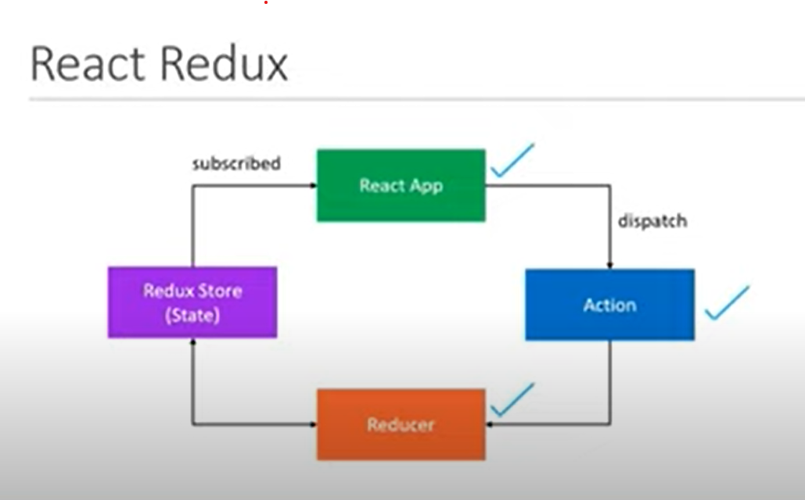
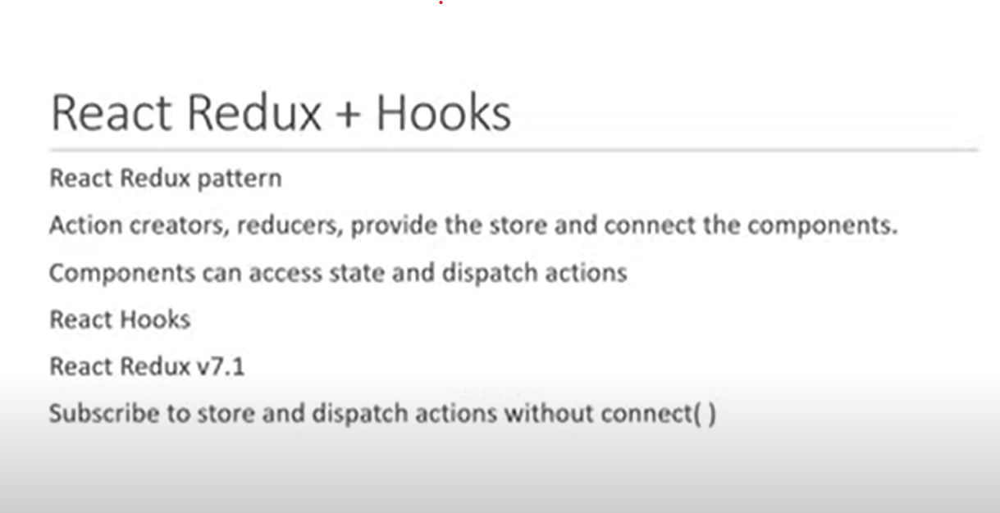

npm i redux react-redux

create component folder add CakeContainer.js


React-redux

Various folder Structure, use any based on the requirement


Create redux folder in src
create cake floder




//Action creator
create cakeActions file
Also create string const File as CakeTypes


//Reducer
create cakeReducer.js

//Redux store
within redux folder create store.js


//now we can make use of react-redux libarary using provider

```js 
//App.js

import './App.css';
import { CakeContainer } from './components/CakeContainer';
import { Provider } from "react-redux";
import store from './redux/store';


function App() {
  return (
    <Provider store={store}>
      <div className="App">
        <CakeContainer />
      </div>
    </Provider>
  );
}

export default App;

```


Now we can work in cakeContainer.js

```js 
import React from 'react'

const CakeContainer = () => {
    return (
        <div>
            <h2>Number of Cakes</h2>
            <button>Buy Cake</button>
        </div>
    )
}

const mapStatetoProps = (state) => {
    return {
        numberOfCakes: state.numberOfCakes
    }
}

const mapDispatchToProps = (dispatch) => {
    return {
        buyCake : () => dispatch(buyCake())
    }
}

export default CakeContainer

```


to get buyCake(), we create seperate file called index.js

Now that we have created map to prop, we need to connect them in the same container to make use as props,we make use of connect from react-redux;

```js 
import React from 'react'
import { buyCake } from '../redux';
import { connect } from 'react-redux';


const CakeContainer = () => {
    return (
        <div>
            <h2>Number of Cakes</h2>
            <button>Buy Cake</button>
        </div>
    )
}


const mapStatetoProps = (state) => {
    return {
        numberOfCakes: state.numberOfCakes
    }
}

const mapDispatchToProps = (dispatch) => {
    return {
        buyCake: () => dispatch(buyCake())
    }
}

export default connect(
    mapStatetoProps,
    mapDispatchToProps
)(CakeContainer)

```

Now we can make use as props
```js 
import React from 'react'
import { buyCake } from '../redux';
import { connect } from 'react-redux';


const CakeContainer = (props) => {
    return (
        <div>
            <h2>Number of Cakes = {props.numberOfCakes}</h2>
            <button onClick={props.buyCake}>Buy Cake</button>
        </div>
    )
}


const mapStatetoProps = (state) => {
    return {
        numberOfCakes: state.numberOfCakes
    }
}

const mapDispatchToProps = (dispatch) => {
    return {
        buyCake: () => dispatch(buyCake())
    }
}

export default connect(
    mapStatetoProps,
    mapDispatchToProps
)(CakeContainer)

```

React-Redux + Hook





useSelector() is hook in react-redux library === mapStatetoProps using connect

useDispatch() is hook in react-redux library === mapDispatchtoProps using connect

```js 
import React from 'react'
import { useDispatch, useSelector } from 'react-redux'
import { buyCake } from '../redux';


export const HooksCakeContainer = () => {

    const numberOfCakes = useSelector(state => state.numberOfCakes);
    const dispatch = useDispatch();

    return (
        <div>
            <h3>using Hooks below</h3>
            <h2>Number of Cakes = {numberOfCakes}</h2>
            <button onClick={() => dispatch(buyCake())}>Buy Cake</button>
        </div>
    )
}

```


React-reduc - Action Payload

check NewCakeContainer.js, and its respective redux changes.

